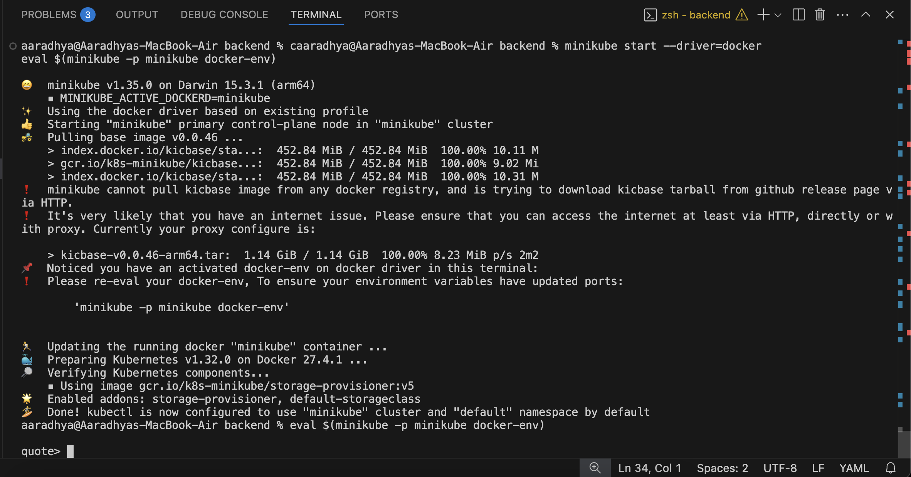
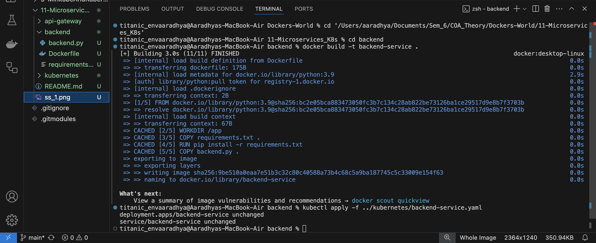
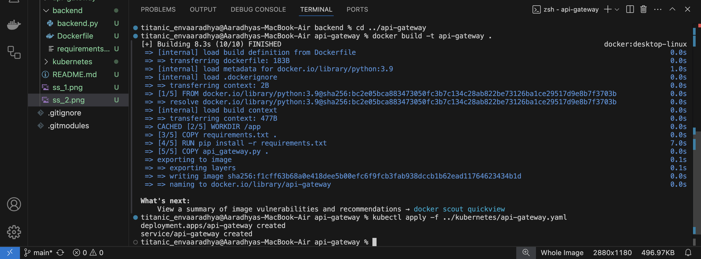
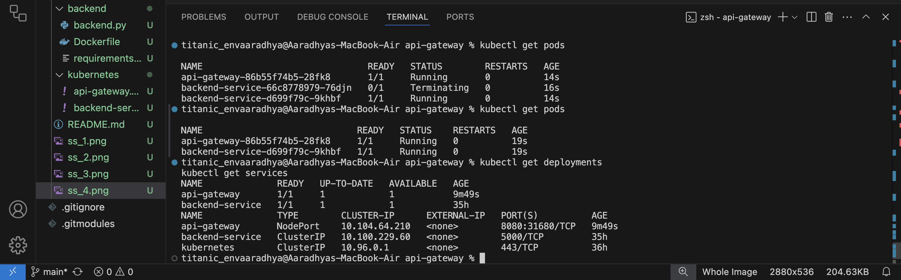
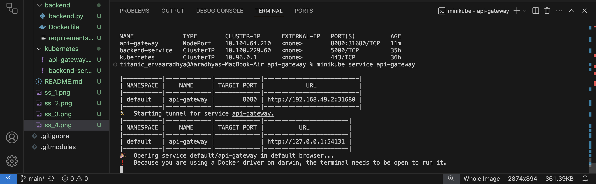
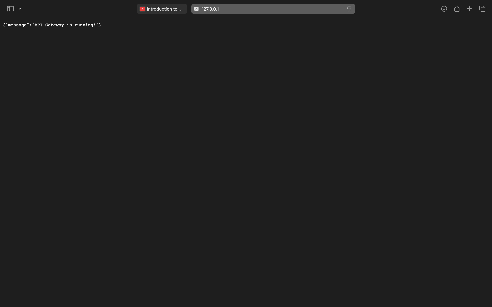
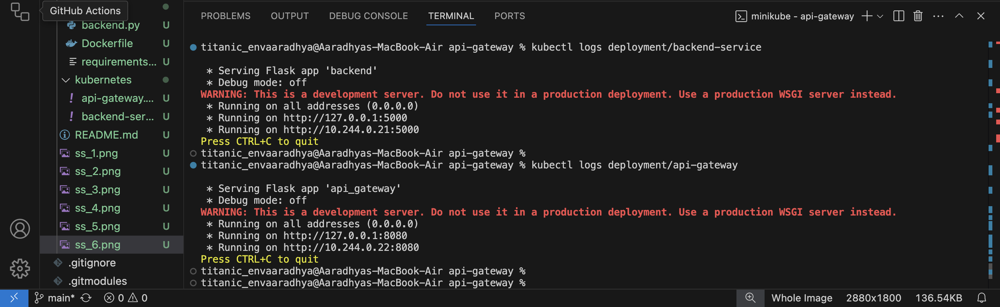
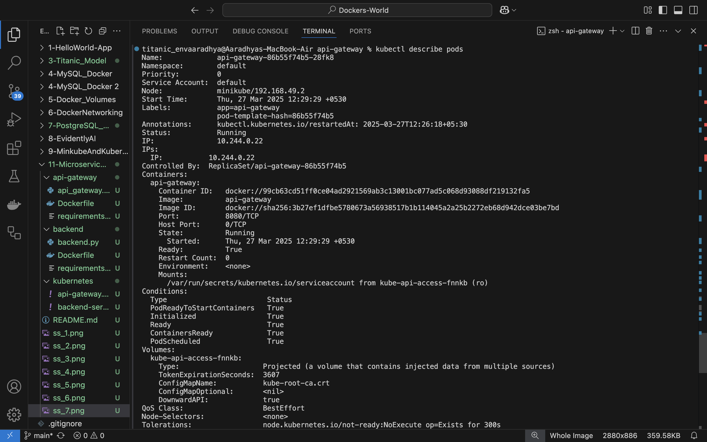

# Microservices Orchestration with Minikube & Kubernetes

This repository demonstrates how to deploy a microservices-based architecture using Minikube, Kubernetes, and Docker. It consists of an **API Gateway** and a **Backend Service** running inside a Minikube cluster.

---

## Prerequisites
Before you begin, ensure you have the following installed:
- **Minikube** - For running a local Kubernetes cluster
- **kubectl** - For interacting with the Kubernetes cluster
- **Docker** - For building container images

---

## Project Structure
```
.
├── README.md
├── backend/
│   ├── Dockerfile
│   ├── backend.py
│   └── requirements.txt
├── api-gateway/
│   ├── Dockerfile
│   ├── api_gateway.py
│   └── requirements.txt
└── kubernetes/
    ├── backend-service.yaml
    └── api-gateway.yaml
```

---

## 🚀 Setup Instructions

### 1️⃣ Start Minikube
First, start your Minikube cluster:
```sh
minikube start
```
Since VirtualBox caused issues, we use Docker as the driver:
```sh
minikube start --driver=docker
```
### 2️⃣ Set Up Docker Environment
Configure Docker to use Minikube’s Docker daemon:
```sh
eval $(minikube -p minikube docker-env)
```


---

### 3️⃣ Build and Deploy Services

#### 🔹 Backend Service
```sh
cd backend
# Build the Docker image
docker build -t backend-service .
# Deploy the backend service
kubectl apply -f ../kubernetes/backend-service.yaml
```


#### 🔹 API Gateway
```sh
cd ../api-gateway
# Build the Docker image
docker build -t api-gateway .
# Deploy the API Gateway
kubectl apply -f ../kubernetes/api-gateway.yaml
```


---

### 4️⃣ Verify Deployment
Check if everything is running correctly:
```sh
kubectl get deployments
kubectl get services
```


---

### 5️⃣ Access the Application
Expose and access the API Gateway service:
```sh
minikube service api-gateway
```
This opens a browser with the API Gateway response.


---

### 6️⃣ Monitoring and Debugging
To check logs for debugging:
```sh
# Logs of the API Gateway
kubectl logs deployment/api-gateway

# Logs of the Backend Service
kubectl logs deployment/backend-service

# Get pod details
kubectl describe pods
```


---

### 7️⃣ Clean Up Resources
When you're done, clean up everything:
```sh
# Delete Kubernetes resources
kubectl delete -f kubernetes/api-gateway.yaml
kubectl delete -f kubernetes/backend-service.yaml

# Stop Minikube
minikube stop
```




---

## 🔍 Architecture Overview
### Components
#### **API Gateway**
- Acts as the entry point for all client requests
- Routes requests to appropriate backend services
- **Port:** 8080

#### **Backend Service**
- Handles business logic
- Returns simple responses
- **Port:** 5000

### 🔁 Communication Flow
1️⃣ Client → API Gateway (Port 8080)  
2️⃣ API Gateway → Backend Service (Port 5000)  
3️⃣ Backend Service → API Gateway  
4️⃣ API Gateway → Client  

---

## 🎉 Happy Coding! 🚀

