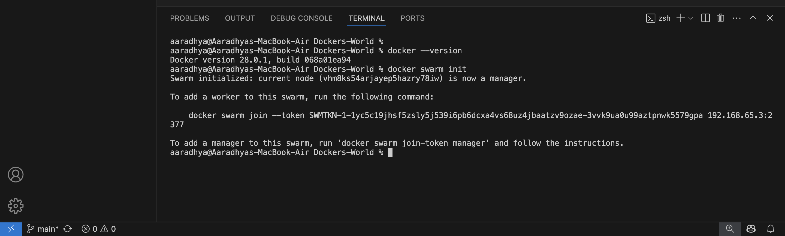
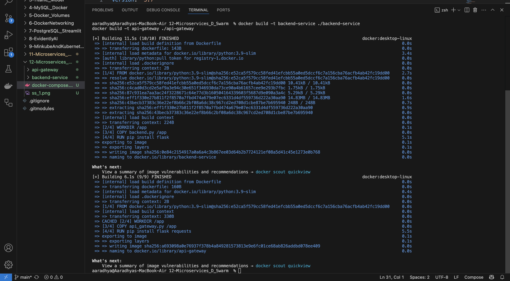
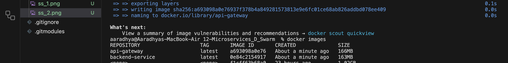
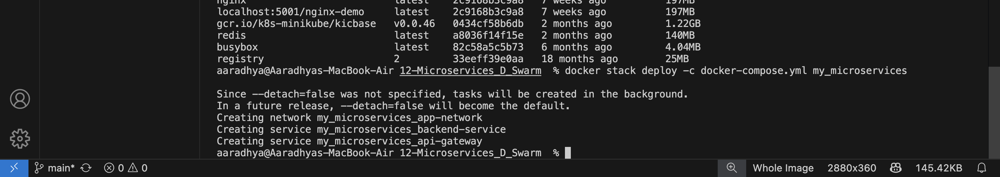
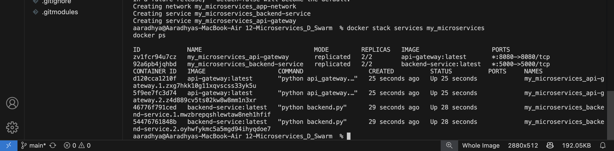
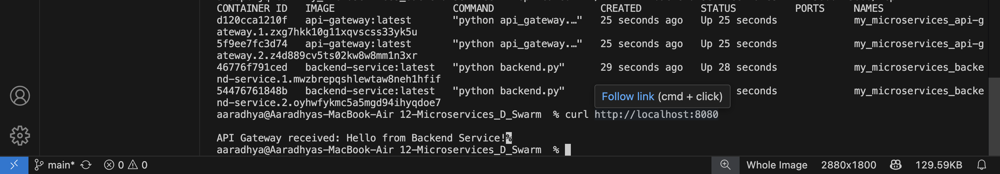
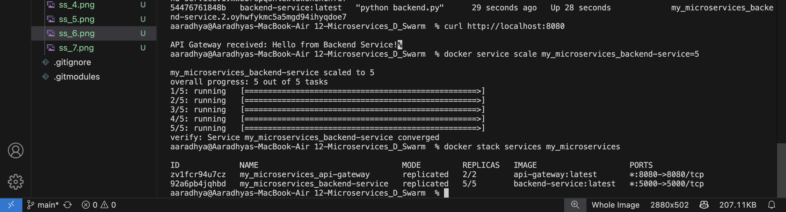
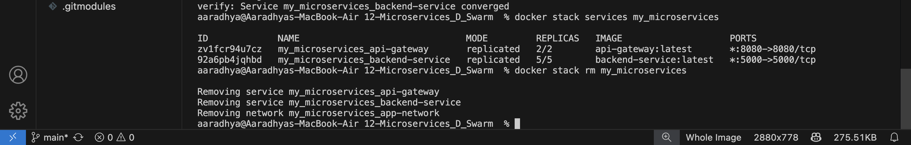

# 🚀 Microservices Deployment with Docker Swarm

## 📌 Introduction
This project demonstrates how to deploy a microservices-based architecture using Docker Swarm. The setup includes an **API Gateway** and a **Backend Service** managed as Docker services in a Swarm cluster.

## 📂 Project Structure
```
12-Microservices_D_Swarm/
│── api-gateway/            # API Gateway microservice
│   ├── api_gateway.py      # API Gateway code
│   ├── Dockerfile          # Dockerfile for API Gateway
│
│── backend-service/        # Backend microservice
│   ├── backend.py          # Backend service code
│   ├── Dockerfile          # Dockerfile for Backend
│
│── docker-compose.yml      # Docker Compose file for Swarm deployment
│── README.md               # Project documentation
│── ss_1.png to ss_10.png   # Screenshots
```

## 🔧 Setup Instructions
### **1️⃣ Install Docker & Initialize Swarm**
Ensure Docker is installed and running. Then, initialize Docker Swarm:
```bash
docker swarm init
```


### **2️⃣ Build and Tag Docker Images**
```bash
docker build -t backend-service ./backend-service
docker build -t api-gateway ./api-gateway
```




### **3️⃣ Deploy Services with Docker Swarm**
```bash
docker stack deploy -c docker-compose.yml my_microservices
```


### **4️⃣ Verify Running Services**
```bash
docker stack services my_microservices
docker ps
```


### **5️⃣ Test the Deployment**
Access the API Gateway at:
```
http://localhost:8080
```
Expected output:
```
API Gateway received: Hello from Backend Service!
```



### **6️⃣ Scale the Backend Service**
```bash
docker service scale my_microservices_backend-service=5
```


### **7️⃣ Update the Service**
If `backend.py` is modified:
```bash
docker build -t backend-service ./backend-service
docker service update --image backend-service:latest my_microservices_backend-service
```

### **8️⃣ Remove Deployment & Leave Swarm**
```bash
docker stack rm my_microservices
docker swarm leave --force
```



## 🎯 Conclusion
This project successfully deploys a microservices architecture using Docker Swarm, demonstrating scalability and efficient container orchestration. 🚀


